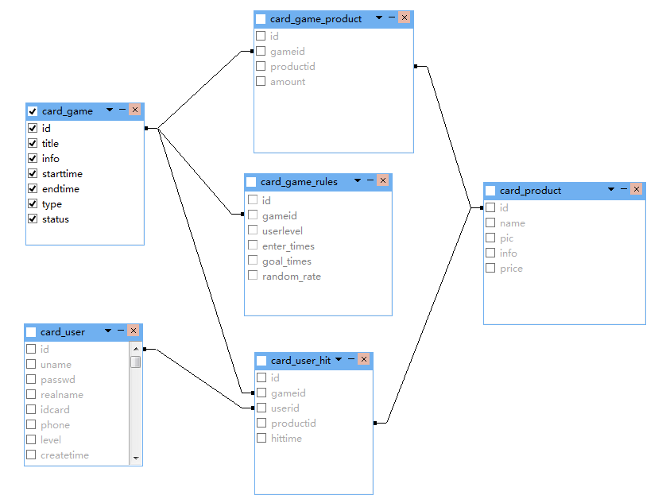
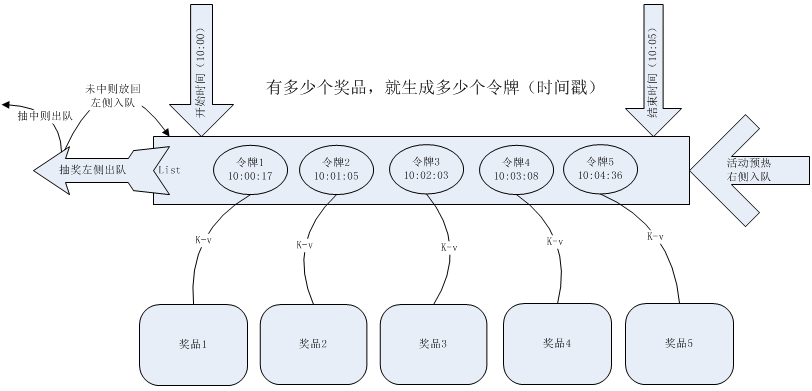
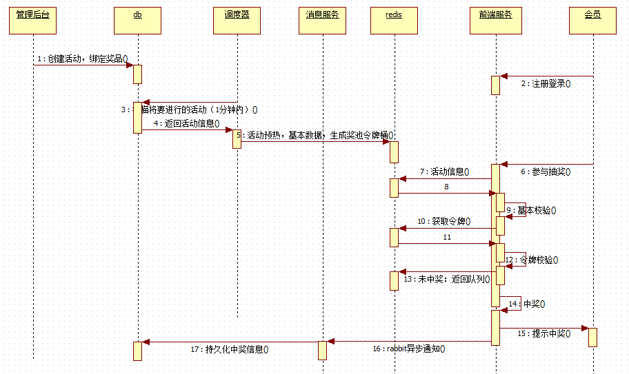
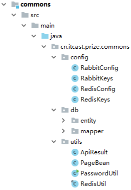

# 1.项目介绍
## 1.1项目概述

### 1.1.1概述

京东的红包雨大家可能都参与过，在某段时间内随机发放不同的红包

本项目为一个通用的红包雨模式抽奖系统，兼容多种规则。

由管理后台配置相关活动和奖品等信息，前端用户通过参与活动，完成抽奖。


### 1.1.2应用场景

1）时间随机（本期完成）

在一段时间内，设置一批礼品，这些礼品不定时的出现，尽量在这段时间内均匀抛出，一旦出现，就可以被抓走。类似抓红包。


2）瞬间秒杀

用于抢单或者秒杀场景，到点后，用户一起抽奖，机会均等，谁抢的快算谁的。这个并发比较高。但是活动时间相对较短。


3）机会随机

常见于转盘类活动。不同等级的用户，设定不同的中奖概率，一般配合设置用户最大可抽奖次数，比如5次机会，能不能中奖，根据概率判定。一般活动时间设置的较长，比如几天。


**备注：本期迭代我们只实现时间随机类抓红包**


### 1.1.3系统痛点
1) 并发性

抽奖系统涉及到访问量大的问题。系统所面临的第一关，即活动开始的瞬间，大批用户点击的涌入。怎样设计系统以达到如此高并发情况下的及时响应是本项目的重中之重。


2) 库存控制

抽奖面临的必然是奖品。数量控制是必须要做到精准吻合。不允许出现设置了5个奖品，最终6人中奖这种类似的问题出现。其中的本质是奖品库存的控制。


3) 投放策略

在活动时间段内，管理员设置好的一堆奖品如何投放？红包何时出现？什么时候可以被抽中？这些都涉及到投放策略。


4) 边界控制

活动何时开始？何时结束？倒计时如何控制。这涉及到活动的边界。开始前要提防用户提前进入抽奖。结束后要及时反馈结果给用户，告知活动已结束。


5) 活动自由配置

后台管理员可以自由配置多个活动的开始结束时间，主题、活动简介、有哪些奖品、不同等级的用户中奖的策略。活动之间独立运行，互不干扰。


6) 中奖策略

每个用户参与抽奖后，要遵从后台管理员所设定的中奖策略，对其可抽奖次数、最大中奖次数、中奖概率等做到严格控制。


## 1.2功能说明
### 1.2.1管理后台
#### 1) 会员管理

功能：用户查询、用户新增、删除、修改密码

用户管理为管理员提供基本的用户录入。本项目可参与抽奖的用户由管理员后台直接录入，不允许私自注册其他非法账号。已录入的账号可以在抽奖前端页面中登录，参与抽奖。

在电商面向C端用户的情况下，用户可能来自其他团队开发的用户中心等平台的接口。


#### 2) 会员等级

功能：等级新增、删除、编辑

不同等级的会员有不同的中奖策略设置。比如高级别的会员中奖次数更多。详细会涉及下面活动配置中策略配置一节


#### 3) 活动管理


基础信息配置

功能：新增活动，修改活动，删除活动，配置活动基本信息（开始结束时间，标题，说明）

活动的基本信息管理功能


策略配置

功能：新增，修改，删除策略

策略涉及到用户的中奖次数，可以为不同等级的用户设置不同的最大中奖机会。不设置或者设置为0表示次数不限。


奖品配置

功能：添加，删除，编辑奖品

为活动配置响应的奖品，可以添加多个不同的奖品，并为每个奖品设置单独的数量。


#### 4) 奖品管理

奖品管理

功能：奖品增加，编辑，删除

录入奖品的基本信息，可以供多个活动引用。


#### 5) 信息管理

中奖统计

功能：只有按条件查询，不涉及其他操作

统计每个活动的奖品总数，以及被抽走的数量。该功能只涉及数据的统计，不涉及新增修改删除，属于只读操作。


中奖列表

功能：基于各种条件查询中奖详情

可以根据所需条件，查询到相关的中奖信息，中奖人信息，奖品信息，中奖时间等。该功能只涉及数据的统计，不涉及新增修改删除，属于只读操作。


6) 系统管理

操作日志

功能：查询管理员的操作日志

该功能用于记录管理员的操作。可以根据ip，操作时间内容，以及操作人查询到在后台中的行为。只涉及数据的统计，不涉及新增修改删除，属于只读操作。


### 1.2.2前台展示

#### 1) 活动列表


#### 2) 活动详情


#### 3) 抽奖展示


#### 4) 个人中心


# 2.系统设计

## 2.1建模

### 2.1.1 ER图



### 2.1.2 数据表

#### 1）奖品表

card_product

| 字段    | 类型               | 备注   |
| ----- | ---------------- | ---- |
| id    | int(10) unsigned |      |
| name  | varchar(255)     | 奖品名称 |
| pic   | varchar(255)     | 图片   |
| info  | varchar(1000)    | 简介   |
| price | decimal(10,2)    | 市场价  |

#### 2）活动表

card_game

| 字段      | 类型             | 备注                                          |
| --------- | ---------------- | --------------------------------------------- |
| id        | int(10) unsigned |                                               |
| title     | varchar(255)     | 活动主题                                      |
| info      | varchar(1000)    | 活动简介                                      |
| starttime | datetime         | 开始时间                                      |
| endtime   | datetime         | 结束时间                                      |
| type      | tinyint(2)       | 类型（1=时间随机，2=瞬间秒杀 ，3 = 机会随机） |
| status    | tinyint(1)       | 状态（0=新建，1=已加载）                      |

#### 3）会员表

card_user

| 字段         | 类型               | 备注   |
| ---------- | ---------------- | ---- |
| id         | int(11) unsigned |      |
| uname      | varchar(20)      | 用户名  |
| passwd     | varchar(50)      | 密码   |
| realname   | varchar(10)      | 姓名   |
| idcard     | varchar(18)      | 身份证号 |
| phone      | varchar(15)      | 手机号码 |
| level      | smallint(6)      | 等级   |
| createtime | datetime         | 注册时间 |
| updatetime | datetime         | 更新时间 |

#### 4）策略表

card_game_rules

| 字段        | 类型             | 备注                    |
| ----------- | ---------------- | ----------------------- |
| id          | int(11) unsigned |                         |
| gameid      | int(11) unsigned | 活动id                  |
| userlevel   | smallint(6)      | 会员等级                |
| enter_times | smallint(6)      | 可抽奖次数（0为不限）   |
| goal_times  | smallint(6)      | 最大中奖次数（0为不限） |
| random_rate | tinyint(4)       | 用户中奖概率            |

#### 5）中奖记录

card_user_hit

| 字段        | 类型               | 备注   |
| --------- | ---------------- | ---- |
| id        | int(10) unsigned |      |
| gameid    | int(10) unsigned | 活动   |
| userid    | int(10) unsigned | 用户   |
| productid | int(10) unsigned | 奖品   |
| hittime   | datetime         | 中奖时间 |

#### 6）奖品活动关联

card_game_product

| 字段        | 类型               | 备注   |
| --------- | ---------------- | ---- |
| id        | int(10) unsigned |      |
| gameid    | int(11) unsigned | 活动id |
| productid | int(11)          | 奖品id |
| amount    | smallint(6)      | 数量   |

### 2.1.3 视图

#### 1）中奖信息

view_card_user_hit

| 字段        | 类型               | 备注   |
| --------- | ---------------- | ---- |
| id        | int(10) unsigned |      |
| title     | varchar(255)     | 活动主题 |
| type      | varchar(100)     | 值    |
| uname     | varchar(20)      | 用户名  |
| realname  | varchar(10)      | 姓名   |
| idcard    | varchar(18)      | 身份证号 |
| phone     | varchar(15)      | 手机号码 |
| level     | varchar(100)     | 值    |
| name      | varchar(255)     | 奖品名称 |
| price     | decimal(10,2)    | 市场价  |
| gameid    | int(10) unsigned | 活动   |
| userid    | int(10) unsigned | 用户   |
| productid | int(10) unsigned | 奖品   |
| hittime   | datetime         | 中奖时间 |

#### 2）奖品数统计

view_game_curinfo

| 字段        | 类型               | 备注   |
| --------- | ---------------- | ---- |
| id        | int(10) unsigned |      |
| title     | varchar(255)     | 活动主题 |
| starttime | datetime         | 开始时间 |
| endtime   | datetime         | 结束时间 |
| type      | varchar(100)     | 值    |
| total     | decimal(27,0)    |      |
| hit       | bigint(21)       |      |

 

## 2.2概要设计

### 2.2.1系统拓扑

#### 1）业务架构

管理后台

抽奖接口层

抽奖前台页面


#### 2）软件架构

管理后台可以采用快速开发平台完成增删改查

接口层采用Springboot

前端使用Vue


### 2.2.2设计原则

开工前，可能想到的一些思想和规划……

#### 1）动静分离

1·后台springboot启动微服务模块

2.静态文件分离，nginx直接响应

#### 2）微服务化

1.可以将接口层搭建两个Springboot

2.主流程和中奖后的处理流程拆分成不同的服务

#### 3）负载均衡

1·接口层可以启动多个实例，通过nginx做负载均衡，提升并发性能

2·开发期间可以启动本地1台节点。生产部署会涉及多台机器，用nginx实现。

#### 4）异步消息

1·中奖后，中奖人及奖品信息要持久化到数据库。引入rabbitmq，将抽奖操作与数据库操作异步隔离。

2·抽奖中奖后，只需要将中奖信息放入rabbitmq，并立即返回中奖信息给前端用户。

3·后端msg模块消费rabbitmq消息，缓慢处理。

#### 5）缓存预热

1·每隔1分钟扫描一次活动表，查询未来1分钟内将要开始的活动。

2·将扫到的活动加载进redis，包括活动详细信息，中奖策略信息，奖品信息，抽奖令牌。

3·活动正式开始后，基于redis数据做查询，不必再与数据库打交道。


### 2.2.3缓存体系

开始我们的设计……



#### 1）活动基本信息

k-v，以活动id为key，活动对象为value，永不超时

```java
redisUtil.set(RedisKeys.INFO+game.getId(),game,-1);
```

#### 2）活动策略信息

hset，以活动id为group，用户等级为key，策略值为value

```java
redisUtil.hset(RedisKeys.MAXGOAL + game.getId(),r.getUserlevel()+"",r.getGoalTimes());
redisUtil.hset(RedisKeys.MAXENTER + game.getId(),r.getUserlevel()+"",r.getEnterTimes());
```

#### 3）抽奖令牌桶

双端队列，以活动id为key，在活动时间段内，随机生成时间戳做令牌，有多少个奖品就生成多少个令牌。令牌即奖品发放的时间点。从小到大排序后从右侧入队。

```java
redisUtil.rightPushAll(RedisKeys.TOKENS + game.getId(),tokenList);
```

#### 4）奖品映射信息

k-v , 以活动id_令牌为key，奖品信息为value，会员获取到令牌后，如果令牌有效，则用令牌token值，来这里获取奖品详细信息

```java
redisUtil.set(RedisKeys.TOKEN + game.getId() +"_"+token,cardProduct,expire);
```

#### 5）令牌设计技巧

 假设活动时间间隔太短，奖品数量太多。那么极有可能产生的时间戳发生重复。

解决技巧：额外再附加一个随机因子。将 （时间戳 * 1000 + 3位随机数）作为令牌。抽奖时，将抽中的令牌/1000 ，还原真实的时间戳。

```java
//活动持续时间（ms）
long duration = end - start;
long rnd = start + new Random().nextInt((int)duration);
//为什么乘1000，再额外加一个随机数呢？ - 防止时间段奖品多时重复
long token = rnd * 1000 + new Random().nextInt(999);
```

#### 6）中奖计数

k-v，以活动id_用户id作为key，中奖数为value，利用redis原子性，中奖后incr增加计数。

抽奖次数计数也是同样的道理

```java
redisUtil.incr(RedisKeys.USERHIT+gameid+"_"+user.getId(),1);
```

#### 7）中奖逻辑判断

抽奖时，从令牌桶左侧出队和当前时间比较，如果令牌时间戳小于等于当前时间，令牌有效，表示中奖。大于当前时间，则令牌无效，将令牌还回，从左侧压入队列。


### 2.2.4业务时序图



 


## 2.3框架选型
### 2.3.1 管理后台

借助开源快速开发平台，完成后台基本的增删改查。

### 2.3.2 微服务模块

#### 1）公共pom

所有项目共用的依赖及版本定义。继承自springboot

- 文档：swagger
- 数据源：mysql，mybatis-plus
- 缓存：redis
- 消息队列：rabbitmq
- 文件存储：minio
- 工具包：fastjson，commos-lang3，commons-collections


#### 2）公共模块commons

分页、密码、统一结果dto等工具类，mybatis生成的实体，mapper，redis及rabbit的配置bean

被api和msg所引用



#### 3）接口模块api

提供给前端页面的rest接口，如：抽奖接口，活动查询接口，中奖信息接口等

注意！需要比父pom多出 spring-web，session-redis

```xml
<dependency>
    <groupId>org.springframework.boot</groupId>
    <artifactId>spring-boot-starter-web</artifactId>
</dependency>
<dependency>
    <groupId>org.springframework.session</groupId>
    <artifactId>spring-session-data-redis</artifactId>
</dependency>
```


#### 4）后台任务msg

涉及到两个功能：

- 调度任务：执行缓存预热
- 异步消息：rabbitmq消费端，接收中奖消息入库


### 2.3.3 微服务框架集成

配置文件样例：

```properties
#服务名
spring.application.name=api
server.port=8001

#分布式session
spring.session.store-type=redis
server.servlet.session.timeout=36000

#以下部分，msg与api通用
spring.datasource.type=com.alibaba.druid.pool.DruidDataSource
spring.datasource.driver-class-name=com.mysql.jdbc.Driver
spring.datasource.url=jdbc:mysql://1.1.1.1/prize?useUnicode=true&characterEncoding=utf-8
spring.datasource.username=prize
spring.datasource.password=prize

mybatis.mapper-locations=classpath:mapper/*.xml

spring.jackson.date-format=yyyy-MM-dd HH:mm:ss
spring.jackson.time-zone=GMT+8

spring.rabbitmq.host=1.1.1.1
spring.rabbitmq.port=5672
spring.rabbitmq.username=guest
spring.rabbitmq.password=guest
spring.rabbitmq.virtual-host=/

spring.redis.host=1.1.1.1
spring.redis.port=9010
```


### 2.3.4 工具

#### 2）mybatis-generator

Mybatis配置文件自动生成工具，由于项目中集成了Mybatis-Plus，也可以使用MybatisX等生成代码

目前项目中已经生成了所有表的相关Service、Mapper、Entity，可以直接使用

该部分不做强制要求，可以自行决定。


#### 3）分页Page

Mybatis-Plus集成了分页工具，在commons下有一个自定义PageBean，是前台约定的分页数据格式标准

可以将Mybatis-Plus返回的Page类包装成PageBean返给前台

构造函数：PageBean(Page page)

```java
@ApiModel("分页信息")
public class PageBean<T> {
    @ApiModelProperty(value = "当前页，1开始")
    private Integer currentPage = 1;
    @ApiModelProperty(value = "每页条数，默认10")
    private Integer pageSize = 10;
    @ApiModelProperty(value = "总条数")
    private Long totalNum;
    @ApiModelProperty(value = "是否有下一页")
    private Integer isMore;
    @ApiModelProperty(value = "总页数")
    private Integer totalPage;
    @ApiModelProperty(value = "开始索引")
    private Integer startIndex;
    @ApiModelProperty(value = "本页数据")
    private List<T> items;
    
    ...
｝
```

返回带分页的数据体：

```json
{
  "code": 1,
  "msg": "成功",
  "data": {
    "currentPage": 1,
    "pageSize": 2,
    "totalNum": 5,
    "isMore": 1,
    "totalPage": 3,
    "startIndex": 0,
    "items": [
      {
        "id": 1,
        "title": "10周年庆典",
        "type": "随机类",
        "uname": "2",
        "realname": "2",
        "idcard": "2",
        "phone": "2",
        "level": "二级会员",
        "name": "iPhoneX一部",
        "price": 5000,
        "gameid": 1,
        "userid": 8,
        "productid": 1,
        "hittime": "2019-09-24 15:26:45"
      },
      {
        "id": 2,
        "title": "10周年庆典",
        "type": "随机类",
        "uname": "2",
        "realname": "2",
        "idcard": "2",
        "phone": "2",
        "level": "二级会员",
        "name": "iPhoneX一部",
        "price": 5000,
        "gameid": 1,
        "userid": 8,
        "productid": 1,
        "hittime": "2019-09-24 15:26:46"
      }
    ]
  }
}
```


### 2.3.2 前端页面

Vue2.x + Vue Router + Axios + TypeScript + Vant ul（前端开发，非重点，了解即可）


# 3.代码实现（TODO）


缓存结构设计回顾：
- 活动开始前1分钟扫描将要开始的活动
- 将活动信息加载进redis
- 将活动策略信息加载进redis
- 按活动奖品信息，生成对应个数的时间戳做令牌，从小到大排好序，右侧入队
- 以令牌为key，对应的奖品为value，建立映射关系，为中奖后获取奖品做准备
- 抽奖开始时，从令牌队列左侧获取令牌
- 如果令牌小于当前时间，说明中奖，找到令牌对应的奖品，抽走
- 如果令牌大于当前时间，说明未中奖，从左侧将令牌还回队列


## 3.1活动预热

### 3.1.1 源码实现

根据缓存结构设计，初始化redis活动相关信息

完成msg项目下的GameTask代码

### 3.1.2 过期时间

活动结束时间 - 当前时间 = 有效时长， 活动结束则缓存自动失效


### 3.1.3 调度策略

每隔1分钟扫描一遍活动表，查询未来1分钟内要开始的活动进行预热。


## 3.2抽奖业务

### 3.2.1 源码实现

按时序图实现业务流程

完成api项目下的ActController代码


### 3.2.2 并发与原子性

抽奖流程里的（判断最大中奖次数、取令牌-判断-放回令牌）已经写好了lua脚本：tokenCheck.lua（可以阅读脚本内容，有详细注释）

api模块下有个LuaScript，可以协助完成Redis里Lua脚本的调用，返回值：查看方法上的详细注释

可以用返回的令牌去redis里找vlue拿真实的奖品


## 3.3中奖处理

### 3.3.1 rabbit配置

RabbitConfig实现rabbit的队列与消费消息配置

### 3.3.2 异步处理

抽奖接口中涉及到两个队列：

```
prize_queue_play：用户参加的活动通过该队列投放
prize_queue_hit：用户中奖后的信息及中的奖品通过该队列投放
```

### 3.3.3 msg模块消费

在msg项目里实现processMessage方法，完成消息接收和入库


## 3.4缓存监控

### 3.4.1 客户端工具

查看缓存信息，可以借助redis-manager等客户端工具来查看Redis里的值


### 3.4.2 编码查看

也可以自己写rest接口，通过swagger查看，相对麻烦需要自己编码写接口


## 3.5代码启动
代码本地启动与自测的方法：

- 启动中间件：mysql，redis，rabbitmq
- 启动msg
- 启动api
- 启动管理后台，创建活动
- 查看msg的日志，是否在开始前的1分钟，将活动预热成功
- 请求抽奖接口，查看是否提示活动未开始
- 开始时间后，请求抽奖接口，调试api，看是否可以正常抽奖
- 中奖后，看msg日志，是否有中奖消息发送到消息模块
- 查看数据库，确认中奖信息是否正常写入db


## 3.6上线部署
### 3.6.1 部署拓扑


### 3.6.2 生产部署

项目代码里的deploy文件夹下已经实现docker-compose的一键部署功能。

详细操作参考项目根目录下的 README.md，一键部署章节

备注：docker-compose里的端口可以根据自己情况修改


### 3.6.3 弹性扩容

**【该部分为选做内容】**

docker-compose可以轻松实现服务扩容，例如对api扩容到三个，只需要修改 yml 文件：


或者使用k8s等编排环境，可以自行探索……


## 3.7 发散思维与总结

### 3.7.1 拓展

1）lua脚本的运用

在以上设计中，lua只是封装了token取放和中奖计数部分，其他操作的原子性在Java代码层实现。


2）怎么实现活动暂停功能？

要实现活动随时暂停，可以新增一个接口，该接口修改redis缓存中的活动状态。

抽奖接口逻辑中增加暂停状态判断。如果是暂停，返回给前台以提示。


3）怎么实现多种投放策略？

投放策略即令牌的生成策略不同。可以修改令牌生成部分代码。按递增，递减，正态分布等多种函数生成时间戳。


### 3.7.2 总结

项目一期实现随机类抽奖

项目二期的秒杀、转盘类，对应的页面已实现，覆盖当前h5文件夹即可

